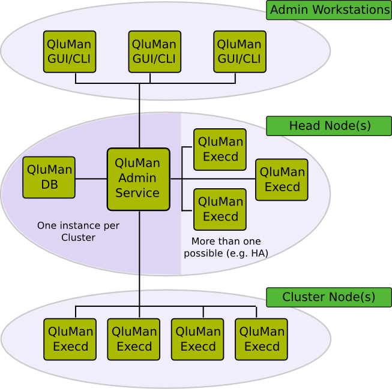

---
# Expose Masterarbeit

author: Kevin Sapper
title: Cloud-Bursting für HPC- und Storage-Cluster

nocite: |
  @qlustar

---

# Einleitung

Die Masterarbeit soll in Zusammenarbeit mit der Firma Q-Leap Networks GmbH
geschrieben werden. Dazu wird ein Problemfeld im Rahmen des Qlustar Produktes
gewählt.

# Problemfeld

Eine große Anzahl von Unternehmen besitzen eigene High-Performance-Computing
(HPC) und Storage Cluster Infrastrukturen. Betrachtet man die absolute Dimension
dieser Infrastruktur zu normalen Geschäftszeiten und zu Peakzeiten, wird man
feststellen, dass ein Großteil der Infrastruktur sich dauerhaft im Leerlauf
befindet. Da diese Infrastrukturen teuer und aufwendig zu warten sind, versuchen
Unternehmen gerade ausreichend Ressourcen zur Verfügung zu haben. Mit dieser
Strategie ist es möglich, in 90+\% der Fälle das Alltagsgeschäft ohne Probleme
zu gewährleisten. Allerdings wird es immer wieder Peaks geben, beispielsweise
während der Weihnachtszeit, wenn die eigene Infrastruktur nicht ausreichend ist.
Da diese Peakspitzen meist nur wenige Minuten oder Stunden andauern, ist es
nicht wirtschaftlich, eine Infrastruktur zu betreiben, welche die meiste Zeit
ungenutzt bleibt. Um dennoch bei Peaks in der Lage zu sein, die eigenen Services
ohne Einschränkungen weiter zu betreiben, ist es möglich, Computing und Storage
Ressourcen von sog. Cloud-Providern zu mieten. Diese Methode des Mieten von
Drittanbieterressourcen wird auch als Cloud-Bursting bezeichnet. Dazu bieten die
Cloud-Provider ein On-Demand-Modell an, d. h. beim Auftreten eines Peaks fordert
man dynamisch beim Cloud-Provider Ressourcen an und gibt diese anschließend
wieder ab. Kann ein Unternehmen schon voraussehen, dass es zu Peaks in einem
bestimmten Zeitraum kommt, können Ressourcen bei Cloud-Providern auch bereits im
Voraus angemietet werden, was meist mit Preisnachlässen belohnt wird. Neben der
Behandlung von Peaks sind Cloud-Ressourcen auch bei einmalige Aufwände ein
nützliches Instrument. Ein Beispiel hierfür ist etwa die New York Times, welche
sich Computing-Ressourcen für einige Tage von einem Cloud-Anbieter geliehen hat,
um ihre Archive zu digitalisieren.

# Zielsetzung {#ziele}

Die Q-Leap Networks GmbH bietet eine Cluster Operating Platform für HPC und
Storage Cluster namens Qlustar an (siehe Abb. \ref{fig:arch}). Diese besteht aus
der Core Platform für die Head-Knoten, auf Basis von Ubuntu LTS und der Edge
Platform für die Cluster-Knoten, auf Basis von Debian oder Ubuntu. Zudem gibt es
noch die Administrationssoftware Qluman. Der Head-Knoten dient der Verwaltung
und der Administration des Clusters. Er ist sowohl mit den Administratoren als
auch den Cluster-Knoten verknüpft. Über die Qluman Software können
Administratoren leichtgewichtige Cluster Images erstellen, welche ausschließlich
die Pakete und Konfigurationen enthalten, die für ihren Einsatzzweck benötigt
werden. Die typische Image Größe liegt daher lediglich bei 150 MB - 200 MB. Das
fertige Image wird vom Head-Knoten über das Preboot Execution Environment (PXE)
an die Cluster-Knoten verteilt. Die Cluster-Knoten booten das Image dann
vollständig im RAM. Des Weiteren ermöglicht die Qluman Software das Ausführen
und Auswerten von Shell-Befehlen auf einer beliebigen Menge von Cluster-Knoten.
Damit mehrere Administratoren gleichzeitig arbeiten können, werden die
Konfigurationen auf dem Head-Knoten in einer Datenbank gespeichert.

{#fig:arch width=50%}

Im Rahmen dieser Arbeit soll eine Analyse zur Anbindung von Cloud-Providern
durchgeführt werden. Die Analyse soll neben der Anbindung auch Aspekte wie
Bezahlung, Registrierung, Sicherheit und Performanz berücksichtigen. Aus dem
Ergebnis der Analyse soll ein Design für einen Cloud-Adapter entwickelt werden.
Dieses Adapter-Design soll es Administratoren ermöglichen, Ressourcen von
Cloud-Anbietern zu mieten, um damit die eigene Infrastruktur zu erweitern oder
komplett zu ersetzen. Anschließend sollen die wesentlichen Funktionen des
Designs für die Qluman Software implementiert werden. Die beiden zu
integrierenden Cloud-Anbieter Plattformen sind Amazon’s *Elastic Compute Cloud*
(EC2) und Google’s *Cloud Platform*. Schließlich soll der entwickelte Prototyp
in Hinsicht auf Funktionalität, Performanz und Sicherheit evaluiert werden.

# Methoden

Zur Umsetzung der in Abschnitt \ref{ziele} beschriebenen Ziele muss zunächst
eine Wissensbasis durch Literaturarbeit in folgenden Grundlagen geschaffen
werden:

* (Cloud) Cluster Management
* Synchronisation von Konfigurationsdaten (CAP Principal @798396)
* Einarbeitung in die API von *EC2* und *Cloud Platform*
* Sicherheitsmechanismen im Cloud-Bereich
* Leistungsbewertung funktioneller Eigenschaften in der Cloud

Weitere Methoden sind:

* OOP-Entwurf
* Prototypenimplementierung
* Funktionelle Leistungsbewertung anhand realer Anwendungsfälle

# Erwartete Ergebnisse

Die erwarteten Ergebnisse der Masterarbeit sind:

* Analyse verschiedener Ansätze zur Anbindung von Cloud-Providern
* Design eines Cloud-Adapters
* Prototyp der wesentlichen Funktionen des Designs für die Qluman Software
* Evaluation des Prototypen, anhand der Erwartungen aus der Analyse

# Vorbedingungen

* Accounts und Kontingente für Amazons’s *EC2* und Google’s *Cloud Platform*.

# Literatur

